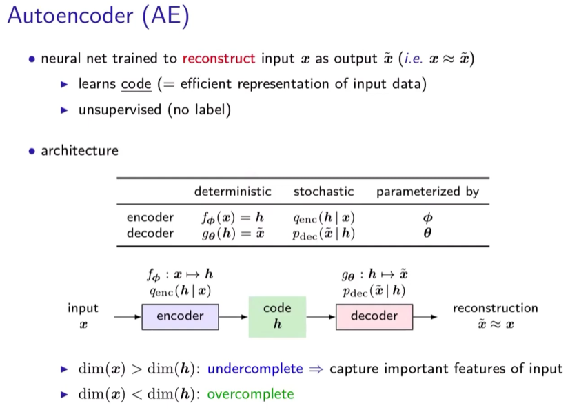

# LSTM-AutoEncoder model python
* [**model.py**](./LSTM_AE_model.py)

# AutoEncoder

[최대우도법(MLE)](https://angeloyeo.github.io/2020/07/17/MLE.html)

[[정리노트] AutoEncoder의 모든것 Chap1. Deep Neural Network의 학습 방법에 대해 알아보자(딥러닝 학습방법)](https://deepinsight.tistory.com/123?category=842339)

[https://www.youtube.com/watch?v=9yPFXhkqV1w](https://www.youtube.com/watch?v=9yPFXhkqV1w)

- 여기서 Code h : 차원을 압축시켜주는(또는 늘려주는) 중요 Feature

### Denoising AutoEncoder(DAE)

### Sparse AutoEncoder

### Contractive AutoEncoder (CAE)

